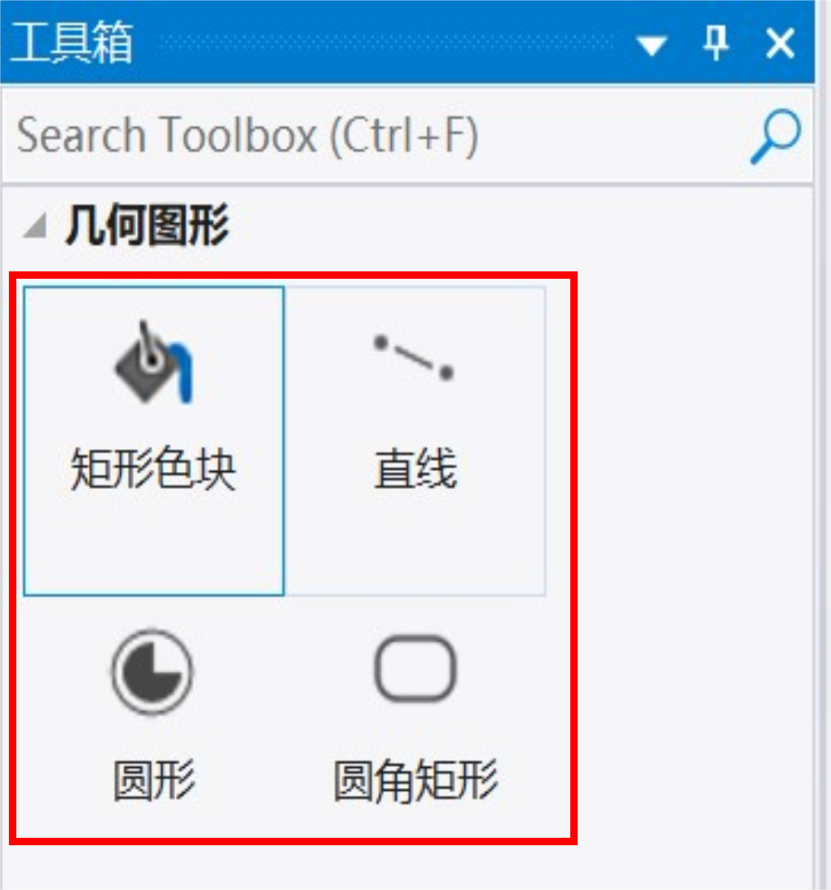

# 1 几何图形控件组

<figure><figcaption>
工具箱中的几何图形控件组
</figcaption></figure>

几何图形控件组包括矩形色块、直线、圆形、圆角矩形。

## 1.1 矩形色块

矩形色块，可以指定任何像素分配单一颜色，可以为矩形指定任何大小和位置。

<figure><figcaption>
模拟器中运行的矩形色块
</figcaption></figure>

### 属性

<table><thead><tr><th width="144.6500244140625">属性组</th><th>属性说明</th></tr></thead><tbody><tr><td>名称</td><td>控件名称，可以修改</td></tr><tr><td>位置</td><td>锁定 锁定/解锁对象的大小和位置</td></tr><tr><td></td><td>X/Y 指定控件坐标（坐标原点为画布左上角）</td></tr><tr><td></td><td>宽度/高度 指定控件的宽度/高度</td></tr><tr><td>外观</td><td>显示 指定控件的可见性   也可以绑定变量</td></tr><tr><td></td><td>不透明度 指定控件的透明度（0-100之间)</td></tr><tr><td>控制</td><td>填充颜色 可以指定控件为任何一种单一颜色</td></tr></tbody></table>

所有控件可以实现交互逻辑，具体说明可见交互编辑说明页。

## 1.2 直线

直线，从一个点到另一个点绘制直线。线条可以由单一颜色、渐变、纹理填充等。

<figure><figcaption>
模拟器中运行的直线
</figcaption></figure>

### 属性

<table><thead><tr><th width="111.64999389648438">属性组</th><th>属性说明</th></tr></thead><tbody><tr><td>名称</td><td>控件名称，可以修改</td></tr><tr><td>位置</td><td>锁定 锁定/解锁对象的大小和位置</td></tr><tr><td></td><td>X/Y 指定控件坐标（坐标原点为画布左上角）</td></tr><tr><td></td><td>宽度/高度 指定控件的宽度/高度</td></tr><tr><td>外观</td><td>显示 指定控件的可见性  也可以绑定变量</td></tr><tr><td></td><td>不透明度 指定控件的透明度（0-100之间)</td></tr><tr><td></td><td>渲染模式 可选纹理贴图，单色模式，渐变三种</td></tr><tr><td></td><td>可选择填充色，选择纹理贴图，指定渐变色参数</td></tr><tr><td>形状</td><td>线宽 可指定线条宽度</td></tr><tr><td></td><td>末端式样 可选圆帽或平头</td></tr><tr><td></td><td>起始端X/Y 坐标</td></tr><tr><td></td><td>结束端X/Y 坐标</td></tr></tbody></table>

## 1.3 圆形

圆形控件可以绘制圆形、环、圆弧、扇形等。可以够用图像、单一颜色、渐变等填充。可以对圆心、半径、线宽、末端式样、起始角度、结束角度进行设置。

<figure><figcaption></figcaption></figure>

### 属性

<table><thead><tr><th width="163.3499755859375">属性组</th><th>属性说明</th></tr></thead><tbody><tr><td>名称</td><td>控件名称，对名称进行设置，修改</td></tr><tr><td>位置</td><td>锁定 锁定/解锁对象的大小和位置</td></tr><tr><td></td><td>X/Y 指定控件坐标（坐标原点为画布左上角）</td></tr><tr><td></td><td>宽度/高度 指定控件的宽度/高度</td></tr><tr><td>外观</td><td>显示 指定控件的可见性  也可以绑定变量</td></tr><tr><td></td><td>不透明度 指定控件的透明度（0-100之间)</td></tr><tr><td></td><td>渲染模式 可选纹理贴图，单色模式，渐变三种</td></tr><tr><td></td><td>可选择填充色，选择纹理贴图，指定渐变色参数</td></tr><tr><td>编辑预览</td><td>结束方式可选圆心半径、3点划圆弧</td></tr><tr><td></td><td>显示辅助线可选项</td></tr><tr><td>形状</td><td>圆心X/Y 设圆心的坐标（画布左上角为原点）</td></tr><tr><td></td><td>半径 设圆的半径</td></tr><tr><td></td><td>线宽 可指定线条宽度</td></tr><tr><td></td><td>末端式样 可选圆帽或平头</td></tr><tr><td></td><td>起始角度/结束角度 指定圆的起始点和结束点的角度</td></tr></tbody></table>

## 1.4 圆角矩形

圆角矩形是一种带边框的矩形控件，边框颜色和边框内的颜色都可以指定三种渲染模式：纹理贴图、单色填充、渐变。边框的宽度、矩形的圆角半径、以及4个圆角的选择都可以自由指定。

<figure><figcaption>
模拟器中运行的圆角矩形
</figcaption></figure>

### 属性

<table><thead><tr><th width="259.5999755859375">属性组</th><th>属性说明</th></tr></thead><tbody><tr><td>名称 </td><td>控件名称，对名称进行设置，修改</td></tr><tr><td>位置</td><td>锁定 锁定/解锁对象的大小和位置</td></tr><tr><td></td><td>X/Y 指定控件坐标（坐标原点为画布左上角）</td></tr><tr><td></td><td>宽度/高度 指定控件的宽度/高</td></tr><tr><td>外观</td><td>显示 指定控件的可见性</td></tr><tr><td></td><td>不透明度 指定控件的透明度（0-100之间)</td></tr><tr><td>边框</td><td>宽度 指定边框的宽度值</td></tr><tr><td></td><td>渲染模式 可选纹理贴图，单色模式，渐变三种</td></tr><tr><td></td><td>可选择填充色，选择纹理贴图，指定渐变色参数</td></tr><tr><td></td><td>填充 可选填充与否</td></tr><tr><td>主体</td><td>渲染模式 可选纹理贴图，单色模式，渐变三种</td></tr><tr><td></td><td>可选择填充色，选择纹理贴图，指定渐变色参数</td></tr><tr><td>圆角</td><td>圆角半径 可指定半径值</td></tr><tr><td></td><td>左上/右上/右下/左下圆角 可提定任意角为圆角</td></tr></tbody></table>
