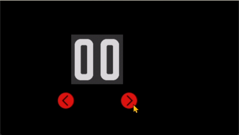

# 2 触摸按扭控件组

<figure><figcaption>
工具箱中的按触摸按钮控件组
</figcaption></figure>

触摸控件组包括按键、开关控件。

## 2.1 按键

按键是一种感应触控事件的控件，能够在按键被释放回调。每种状态（按下和释放）都可以关联图像。

按键通常被视为快速执行的控件。

<figure><figcaption>
模拟器中运行的按键
</figcaption></figure>

### 属性

<table><thead><tr><th width="107.98345947265625">属性组</th><th width="603.8511352539062">属性说明</th></tr></thead><tbody><tr><td>名称</td><td>控件名称，对名称进行设置，修改</td></tr><tr><td>位置</td><td>锁定 锁定/解锁对象的大小和位置</td></tr><tr><td></td><td>X/Y 指定控件坐标（坐标原点为画布左上角）</td></tr><tr><td></td><td>宽度/高度 指定控件的宽度/高</td></tr><tr><td>外观</td><td>显示 指定控件的可见性</td></tr><tr><td></td><td>不透明度 指定控件的透明度（0-100之间)</td></tr><tr><td>图片</td><td>弹起状态 可导入指定图片设置图</td></tr><tr><td></td><td>按下状态 可导入指定图片设置图</td></tr><tr><td></td><td>按键禁用 可导入指定图片设置图</td></tr></tbody></table>

## 2.2 开关(Toggle Button)

开关按钮是一种互斥的特殊按钮控件，每种状态在被点击时互换两张位图，每种状态（按下和弹回）都设置了图像。toggle开关是一种特殊的按钮。下图是开关的几种案例。

<figure><figcaption>
模拟器中运行的几种开关按钮
</figcaption></figure>

### 属性

<table><thead><tr><th width="170.242431640625">属性组</th><th width="627.542724609375">属性说明</th></tr></thead><tbody><tr><td>名称</td><td>控件名称，对名称进行设置，修改</td></tr><tr><td>位置</td><td>锁定 锁定/解锁对象的大小和位置</td></tr><tr><td></td><td>X/Y 指定控件坐标（坐标原点为画布左上角）</td></tr><tr><td></td><td>宽度/高度 不可以更改宽高，选中图片后可以自适配</td></tr><tr><td>外观</td><td>显示 指定控件的可见性</td></tr><tr><td></td><td>不透明度 指定控件的透明度（0-100之间)</td></tr><tr><td>控制</td><td>缺省状态 on/off 还可以绑定某个变量</td></tr><tr><td>图片</td><td>OFF状态/ON状态 按住和弹回时分配不同状态，指定相关图像</td></tr><tr><td></td><td>禁用状态 指定相关图像</td></tr></tbody></table>

