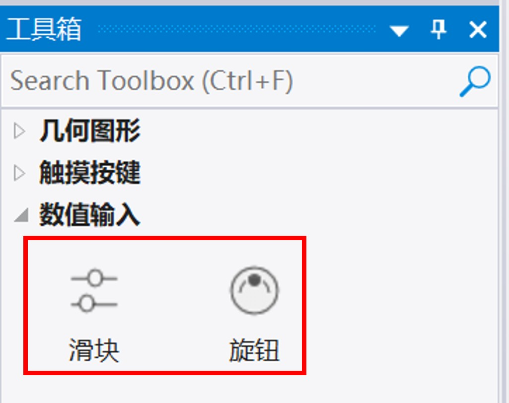
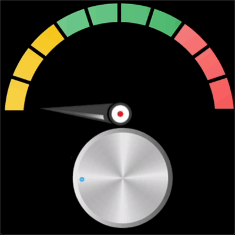

# 3 数值输入控件组

<figure><figcaption>
数值输入控件组
</figcaption></figure>

数值控件组包括滑块、旋钮控件。

## 3.1 滑块

滑块可以在水平或垂直方向显示滑块，通过拖动滑块来体现数值变化。如下为滑块展示效果：

<figure><figcaption>
模拟器中运行的滑块
</figcaption></figure>

### 属性

<table><thead><tr><th width="154.26446533203125">属性组</th><th width="607.1569213867188">属性说明</th></tr></thead><tbody><tr><td>名称</td><td>控件名称，可以修改</td></tr><tr><td></td><td>锁定 锁定/解锁对象的大小和位置</td></tr><tr><td>位置</td><td>X/Y 指定控件坐标（坐标原点为画布左上角）</td></tr><tr><td></td><td>宽度/高度 指定控件的宽度/高度</td></tr><tr><td>外观</td><td>显示 指定控件的可见性</td></tr><tr><td></td><td>不透明度 指定控件的透明度（0-100之间)</td></tr><tr><td>范围</td><td>最小值 /最大值 可以设定滑动数值固定范围，也可以绑定变量</td></tr><tr><td>控制</td><td>此处如果是垂直滑动条，必须选中。 滑动值可以绑定变量，也可以固定值。</td></tr><tr><td>滑轨</td><td>指定滑轨的前景图，背景图。X/Y偏移</td></tr><tr><td></td><td>X/Y偏移 设置滑轨在滑动条内部的X偏移坐标值</td></tr><tr><td>滑块</td><td>图片 指定滑块的图片</td></tr><tr><td></td><td>Y偏移（水平滑块时） X偏移（垂直滑块时）</td></tr><tr><td></td><td>（水平滑块时）左极限X坐标，右极限X坐标</td></tr><tr><td></td><td>（垂直滑块时）上极限Y坐标，右极限Y坐标</td></tr></tbody></table>

## 3.2 旋钮

旋钮控件是一种输入型控件，通过设定旋钮控件的坐标来旋转，配合“数值显示“类控件的”仪表盘“显示，效果如下图

<figure><figcaption>
模拟器的运行的旋钮与仪表控件、圆形进度条组合效果
</figcaption></figure>

### 属性

<table><thead><tr><th width="136.63360595703125">属性组</th><th width="594.4848022460938">属性说明</th></tr></thead><tbody><tr><td>名称</td><td>控件名称，可以修改</td></tr><tr><td></td><td>锁定 锁定/解锁对象的大小和位置</td></tr><tr><td>位置</td><td>X/Y 指定控件坐标（坐标原点为画布左上角）</td></tr><tr><td></td><td>宽度/高度 指定控件的宽度/高度</td></tr><tr><td>外观</td><td>显示 指定控件的可见性</td></tr><tr><td></td><td>不透明度 指定控件的透明度（0-100之间)</td></tr><tr><td>范围</td><td>最小值 /最大值 可以设定滑动数值固定范围，也可以绑定变量</td></tr><tr><td>控制</td><td>此处如果是垂直滑动条，必须选中。 滑动值可以绑定变量，也可以设固定值。</td></tr><tr><td>滑轨</td><td>指定滑轨的前景图，背景图。X/Y偏移</td></tr><tr><td></td><td>X/Y偏移 设置滑轨在滑动条内部的X偏移坐标值</td></tr><tr><td>滑块</td><td>图片 指定滑块的图片</td></tr><tr><td></td><td>Y偏移（水平滑块时） X偏移（垂直滑块时）</td></tr><tr><td></td><td>（水平滑块时）左极限X坐标，右极限X坐标</td></tr><tr><td></td><td>（垂直滑块时）上极限Y坐标，右极限Y坐标</td></tr></tbody></table>
