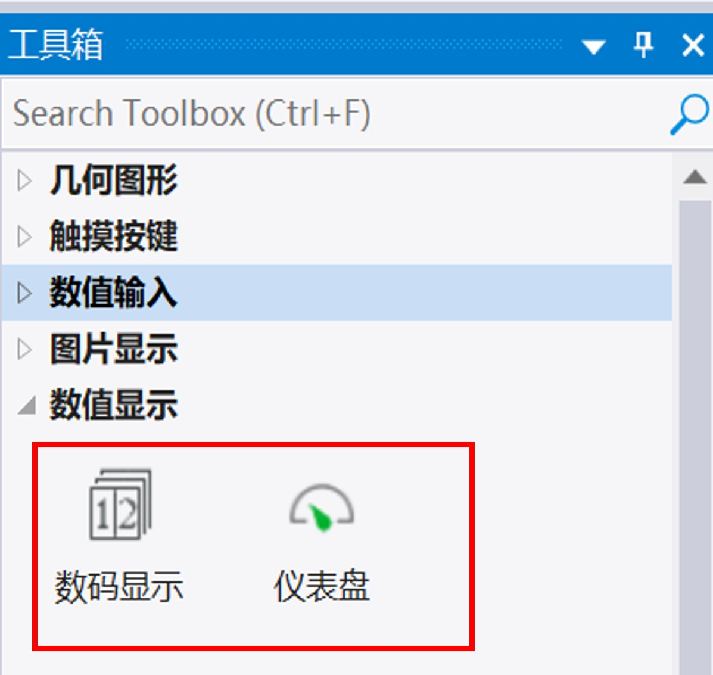
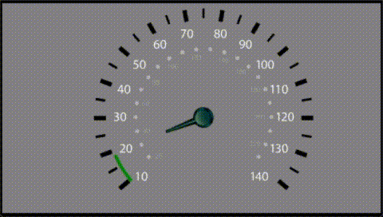

# 4 数码显示控件组

<figure><figcaption>
数值显示控件组
</figcaption></figure>

数值控件组包括数码显示、仪表盘控件。

## 4.1 数码显示

数字变量可以通过数码显示控件来显示。数据输入可以由用户主机输入，或通过设置系统键盘或自定义键盘，对数值输入编辑。

本章节主要介绍控件属性，常见应用配置，其它章节有介绍数码显示与其它控件配合使用例程。

### 属性

<table><thead><tr><th width="145.44903564453125">属性组</th><th>属性说明</th></tr></thead><tbody><tr><td>名称</td><td>控件名称，可以修改</td></tr><tr><td></td><td>锁定 锁定/解锁对象的大小和位置</td></tr><tr><td></td><td>X/Y 指定控件坐标（坐标原点为画布左上角）</td></tr><tr><td></td><td>宽度/高度 对像的宽度/高度值（单位：像素），由图片本身大小决定</td></tr><tr><td>外观</td><td>显示 指定控件的可见性 True/False 或者绑定相关变量</td></tr><tr><td></td><td>不透明度 指定控件的透明度（0-100之间)</td></tr><tr><td></td><td>位数 设置数值显示的位数</td></tr><tr><td></td><td>对齐方式 左对齐/右对齐/居中</td></tr><tr><td></td><td>间距 位数之间的间距</td></tr><tr><td></td><td>高位消隐 可选</td></tr><tr><td>数字图片列表</td><td>0-9，- 绑定相应的图片</td></tr><tr><td>控制</td><td>数据 当需要与其它控件结合使用时，可以绑定相应的变量</td></tr></tbody></table>

## 4.2 仪表盘

仪表盘是一种显示控件，用于反映用户主机上数据的变化，常见于速度、电压、温度等参数的体现，用来满足用户使用的仪器仪表界面。

以下是仪表盘控件显示效果

<figure><figcaption>
模拟器中运行的仪表盘
</figcaption></figure>

### 属性

<table><thead><tr><th width="113.49310302734375">属性组</th><th width="602.1983032226562">属性说明</th></tr></thead><tbody><tr><td>名称</td><td>控件名称，可以修改</td></tr><tr><td>位置</td><td>锁定 锁定/解锁对象的大小和位置</td></tr><tr><td></td><td>X/Y 指定控件坐标（坐标原点为画布左上角）</td></tr><tr><td></td><td>宽度/高度 可以自定义设置</td></tr><tr><td>外观</td><td>显示 指定控件的可见性 True/False 或者绑定相关变量</td></tr><tr><td></td><td>不透明度 指定控件的透明度（0-100之间)</td></tr><tr><td>编辑预览</td><td>显示辅助线 选中时可以通过辅助线来设定仪表盘大小，角度等</td></tr><tr><td>指针</td><td>鼠标调节指针中心 选中时，可通过鼠标移动来调整指针与仪表旋转中心位置重合</td></tr><tr><td></td><td>图片 可以设置自己喜欢的指针样式</td></tr><tr><td></td><td>指针旋转中心X/Y</td></tr><tr><td>形状</td><td>仪表旋转中心X/Y 设置指针绕着旋转的点在仪表内的XY坐标，以整个仪表矩形的左上角为坐标参考</td></tr><tr><td></td><td>起始角度/结束角度 范围（-360-360），当起始角度小于结束角时，指针旋转方向为顺时针，当起始角大于结束角时，指针旋转方向为逆时针</td></tr><tr><td>范围</td><td>最小值- 设置表盘的最低值，默认值为0</td></tr><tr><td></td><td>默认最大值 设置仪表量程的最大值</td></tr><tr><td></td><td>最低阈值级 当输入值低于该值时，指针固定指向阈值对应的角度。当输入值大于该值时，指针指向实际的位置</td></tr><tr><td></td><td>划分级数 将指针在整个有效旋转角度范围等分为多少段</td></tr><tr><td>控制</td><td>显示值 设置指定显示值，或者绑定相关变量</td></tr></tbody></table>

