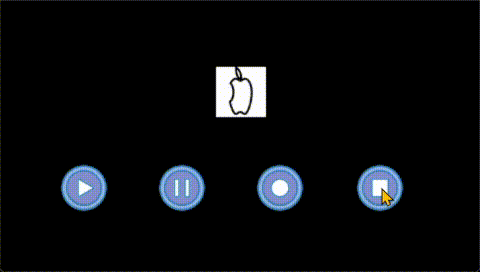

# 5 图片显示控件组

<figure><figcaption>
图片显示控件组
</figcaption></figure>

图片控件组包括图片、图片集、动画。

## 5.1 图片

图片控件关联图片文件中的数据，使用图片文件前，先必须导将其导入到项目中。图片大小由关联图片文件定义，不能在运行时改动。如果需要将图片显示不同大小，需先调整相关图像再导入。

<figure><figcaption>
模拟器中运行的图片
</figcaption></figure>

### 属性

<table><thead><tr><th width="218.17633056640625">属性组</th><th>属性说明</th></tr></thead><tbody><tr><td>名称</td><td>控件名称，可以修改，具有唯一性</td></tr><tr><td>位置</td><td>锁定  在编辑状态下锁定/解锁对象的大小和位置，使之不能通过鼠标修改大小和位置</td></tr><tr><td></td><td>X/Y 指定控件坐标（坐标原点为画布左上角）</td></tr><tr><td></td><td>宽度/高度 此处宽高由导入图片本身决定，不可以更改</td></tr><tr><td>外观</td><td>显示 设置显示或隐藏本对象   True/False或绑定变量</td></tr><tr><td></td><td>不透明度 指定控件的透明度（0-100之间) 0：完全透明  100：完全不透明</td></tr><tr><td>图片</td><td>加载图片</td></tr></tbody></table>

## 5.2 图片集

图片集控件，可以形象的把变量的不同状态显示出来。默认索引从0开始。如下是图片集在模拟器中的展示效果。

<figure><figcaption>
模拟器中运行的图片集
</figcaption></figure>

### 属性

<table><thead><tr><th width="126.75485229492188">属性组</th><th>属性说明</th></tr></thead><tbody><tr><td>名称</td><td>控件名称，可以修改，具有唯一性</td></tr><tr><td>位置</td><td>锁定  在编辑状态下锁定/解锁对象的大小和位置，使之不能通过鼠标修改大小和位置</td></tr><tr><td></td><td>X/Y 指定控件坐标（坐标原点为画布左上角）</td></tr><tr><td></td><td>宽度/高度 此处宽高由导入图片本身决定，不可以更改</td></tr><tr><td>外观</td><td>显示 设置显示或隐藏本对象   True/False或绑定变量</td></tr><tr><td></td><td>不透明度 指定控件的透明度（0-100之间) 0：完全透明  100：完全不透明</td></tr><tr><td>图片索引值</td><td>默认索引值 设置默认的索引值，固定值，或绑定变量</td></tr><tr><td>图片列表</td><td>坐标指定 是否使能单独指定每张图片的显示坐标</td></tr><tr><td></td><td>数量 设置共有多少张图片</td></tr><tr><td>图片</td><td>名称 选择图片库里的相应文件，分别设置索引值</td></tr><tr><td></td><td>X/Y （当‘坐标指定’被选择时），此处可以设定坐标位置</td></tr></tbody></table>

## 5.3 动画

动画控件一种可以通过连续播放静态图像集，模拟动态效果的控件，支持PNG图片格式。用户可以设置动画自动播放，也可以通过按钮触摸。以下是动画控件做成的动画效果。

<figure><figcaption>
模拟器中运行的GIF动画
</figcaption></figure>

### 属性

<table><thead><tr><th width="186.1212158203125">属性组</th><th>属性说明</th></tr></thead><tbody><tr><td>名称</td><td>控件名称，可以修改，具有唯一性</td></tr><tr><td>位置</td><td>锁定 锁定/解锁对象的大小和位置</td></tr><tr><td></td><td>X/Y 指定控件坐标（坐标原点为画布左上角）</td></tr><tr><td></td><td>宽度/高度 此处宽高由导入图片本身决定，不可以更改</td></tr><tr><td>外观</td><td>显示 指定控件的可见性，选择True/False 或绑定变量</td></tr><tr><td></td><td>不透明度 指定控件的透明度（0-100之间) 0：完全透明  100：完全不透明</td></tr><tr><td>动画控制</td><td>使能序列动画 使能自身的简易序列帧动画功能</td></tr><tr><td></td><td>持续时间 设置动画播放所有帧（一个循环）的播放时间。该值 影响序列帧动画播放快慢。值越大播放越慢。</td></tr><tr><td></td><td>状态控制 设置该组显示时所处的动画状态，该值可以绑定到变量，从而实现由外部动态控制动画。当绑定到外部状态变量时：0：停止   1：播放  2：暂停  3：恢复</td></tr><tr><td></td><td>循环播放 True/False 设置为True时，动画将自动循环播放</td></tr><tr><td></td><td>逆序播放 True/False 设置为True时，动画将从最后一帧开始反向顺序播放</td></tr><tr><td>图片序列</td><td>路径 选中序列动画文件夹</td></tr><tr><td></td><td>图片数量 选中文件夹后会自动显示</td></tr><tr><td></td><td>当前帧索引值 默认值为0</td></tr></tbody></table>

