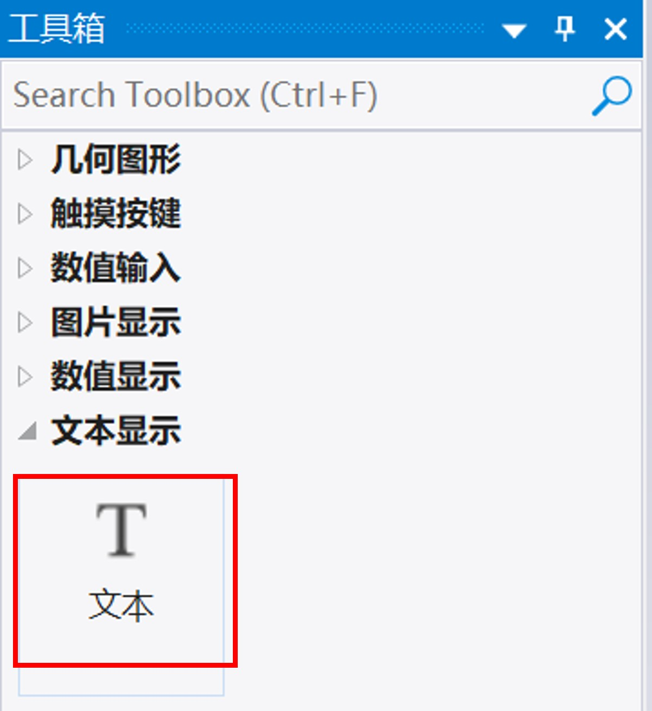
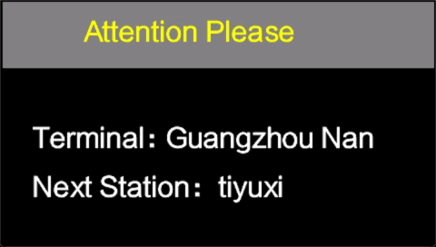
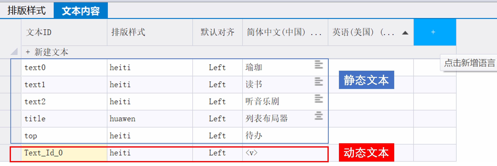
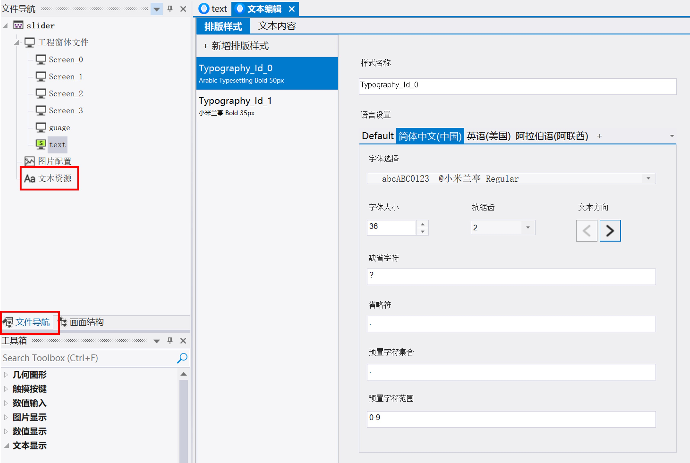

# 6 文本显示控件组

<figure><figcaption>
文本显示控件
</figcaption></figure>

## 6.1 文本

<figure><figcaption>
模拟器中运行的文本
</figcaption></figure>

文本控件可以对字符、数字等进行显示，含静态或动态两种模式。内容可以由用户主机输入（用户单片机控制），也可以通过系统键盘输入。

文本控件拖入工程窗体后，点击左侧文件导航>>文本资源，可以配置项目中的文本、字体排版。包含两个选项卡：文本内容和排版样式。

* 文本内容

文本内容选项卡提供所有文本的总览。

ID: 系统自动生成或自定义ID名

排版样式：选择排版样式

对齐方式：不同语言可以选择不同的对齐方式，如阿拉伯语选右对齐，中文选左对齐。当未指定时，此处的对齐方式为默认方式。

添加语言：添加新的语言，按标题菜单中的“+”按钮。就会显示下图中的弹窗，对新的语言进行配置。文本中有几种语言，版式设置中才可以对已添加语言进行设置。

文本分为两种：静态文本和动态文本，动态文本在ID栏高亮显示。

<figure><figcaption>
文本选项卡
</figcaption></figure>

* 排版样式

本选项卡中可以看到工程中所有字体，如下图如示：

<figure><figcaption></figcaption></figure>

样式名称：字体排版样式名称，可以自定义

语言设置：包括字体排版的语言设置。default适用于所有未指定的语言。添加指定语言点“+”按钮，并从菜单中选择已有的语言（先在文本中添加所需语言）。

### 属性

<table><thead><tr><th width="214.319580078125">属性组</th><th>属性说明</th></tr></thead><tbody><tr><td>名称</td><td>控件名称，可以修改</td></tr><tr><td>位置</td><td>锁定 锁定/解锁对象的大小和位置</td></tr><tr><td></td><td>X/Y 指定控件坐标（坐标原点为画布左上角）</td></tr><tr><td></td><td>宽度/高度 对像的宽度/高度值（单位：像素）</td></tr><tr><td>外观</td><td>显示 指定控件的可见性 True/False 或者绑定相关变量</td></tr><tr><td></td><td>不透明度 指定控件的透明度（0-100之间)</td></tr><tr><td></td><td>默认颜色 可以指定字体颜色，也绑定变量来改变颜色</td></tr><tr><td>文本内容（静态类型）</td><td>文本ID 选择要显示的文本内容</td></tr><tr><td></td><td>内容 编辑当前语言下的显示内容。按下shift键同时按下 Enter,可以实现内容换行</td></tr><tr><td></td><td>排版样式 选择文本排版样式</td></tr><tr><td></td><td>对齐方式 选择当前语言下要显示文本内容的对齐方式</td></tr><tr><td>（动态类型）独有</td><td>内容数据来源 可输入静态字符串内容，或绑定到变量</td></tr><tr><td></td><td>最长字符数 指定动态内容允许显示的最长字符数量</td></tr><tr><td></td><td>左对齐 指定态内容字符串是否左对齐。</td></tr><tr><td></td><td>数值显示占位 指定动态内容中数值显示的占位宽度。哪果显示内容的字符数小于该值，则左端补空格，若大于该值，则按实际位数输出。</td></tr><tr><td></td><td>Hex格式显示 指定数值是否以Hex(16进制）方式显示</td></tr></tbody></table>
