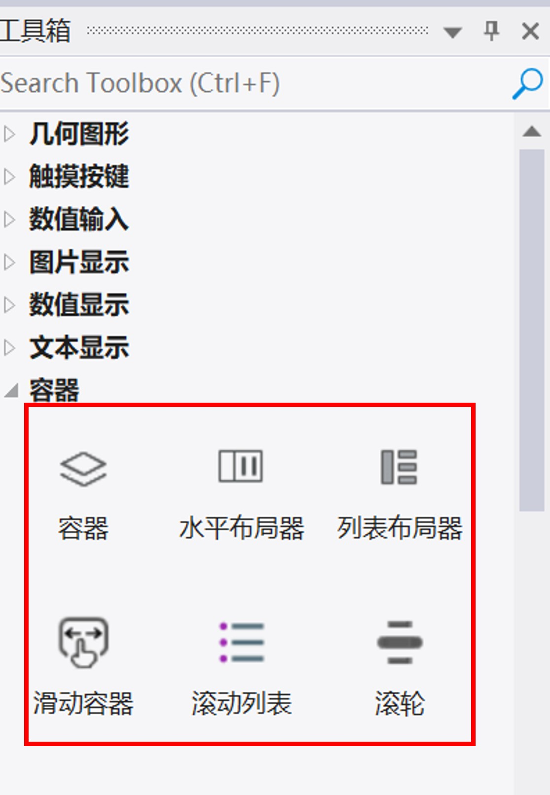
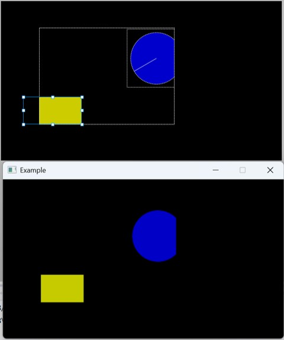
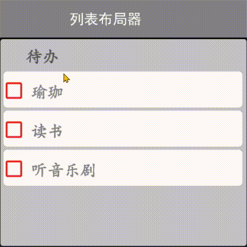
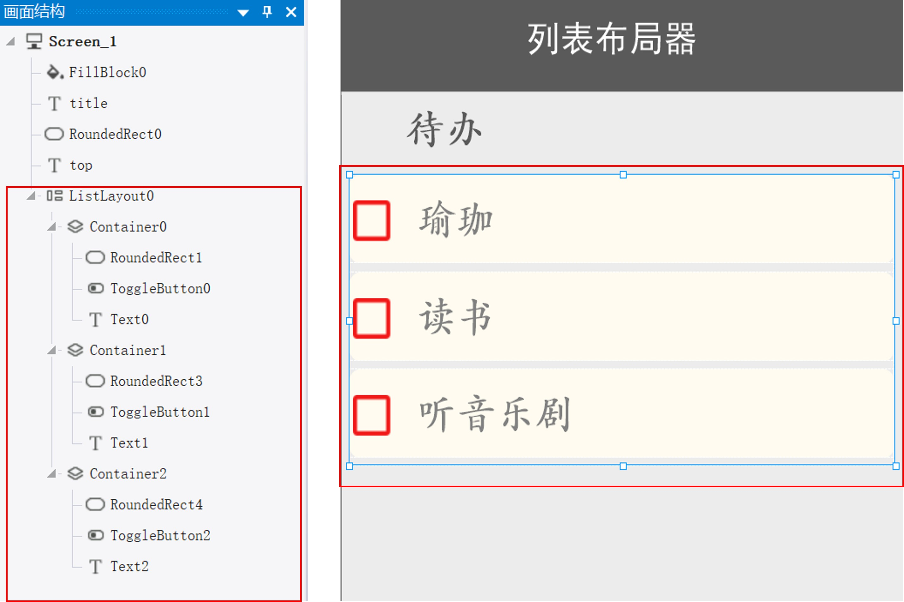
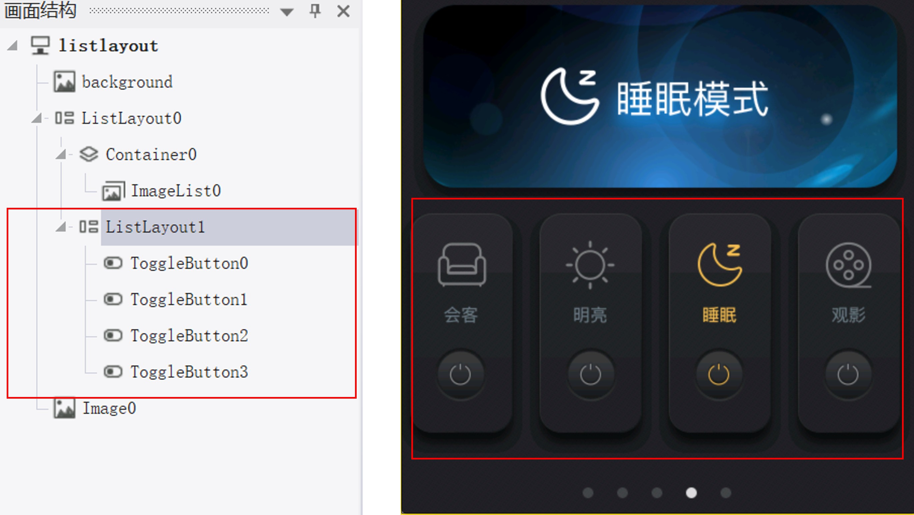
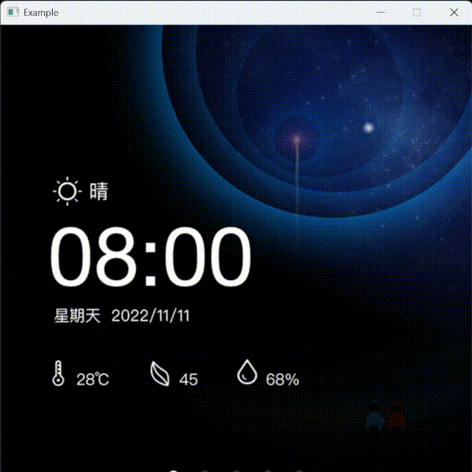
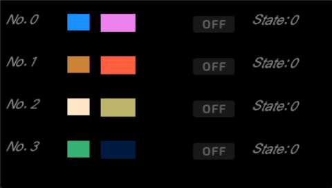

# 7 容器控件组

<figure><figcaption>
工具箱中的容器控件组
</figcaption></figure>

容器控件组包括容器、水平布局器、列表布局器、滑动容器、滚动列表、滚轮等控件。

## 7.1 容器

容器是一种组件，可以包含子节点（比如控件和其它容器）。

在工具箱目录中，找到容器控件，向容器中添加控件的方法将控件拖放（画面结构）树视图的容器中。

子容器在Z轴上的顺序由向容器中添加子容器时的顺序决定-最后添加的子容器将显示在屏幕的最前面。

<figure><figcaption>
容器控件在画布和在模拟器中的效果
</figcaption></figure>

### 属性

<table><thead><tr><th width="150.40771484375">属性组</th><th>属性说明</th></tr></thead><tbody><tr><td>名称</td><td>控件名称，可以修改</td></tr><tr><td>位置</td><td>锁定 锁定/解锁对象的大小和位置</td></tr><tr><td></td><td>X/Y 指定控件坐标（坐标原点为画布左上角）</td></tr><tr><td></td><td>宽度/高度 对像的宽度/高度值（单位：像素）</td></tr><tr><td>外观</td><td>显示 设置显示或隐藏对像 True/False 或者绑定相关变量</td></tr><tr><td></td><td>不透明度 指定控件的透明度（0-100之间)：0完全透明，100完全不透明</td></tr></tbody></table>

## 7.3 列表布局器

列表布局器也是容器的一种，会自动给子控件排列在列表中。列表布局器的几种效果：

<figure><figcaption>
工程1：列表布局器-列表形式
</figcaption></figure> <figure><figcaption>
工程2：列表布局器-水平列表形式
</figcaption></figure>

* 工程1 布局器中放入了3个子容器控件，每个子容器中一个类目，列表布局器会自动排列三个子容器。

<figure><figcaption>
工程1 画面结构与编辑器中的显示
</figcaption></figure>

* 工程2 布局器中放入了4个子容器控件，选中属性>>控制>>水平列表，4个子容器自动水平排列。

<figure><figcaption>
工程2 画面结构与编辑器中的显示
</figcaption></figure>

### 属性

<table><thead><tr><th width="195.48760986328125">属性组</th><th>属性说明</th></tr></thead><tbody><tr><td>名称</td><td>控件名称，可以修改，名称具有唯一性</td></tr><tr><td>位置</td><td>锁定 锁定/解锁对象的大小和位置</td></tr><tr><td></td><td>X/Y 指定控件坐标（坐标原点为画布左上角）</td></tr><tr><td></td><td>宽度/高度 对像的宽度/高度值（单位：像素）</td></tr><tr><td>外观</td><td>显示 设置显示或隐藏对像 True/False 或者绑定相关变量</td></tr><tr><td></td><td>不透明度 指定控件的透明度（0-100之间)：0完全透明，100完全不透明</td></tr><tr><td>控制</td><td>水平列表 是否为水平方向列表布局</td></tr><tr><td></td><td>对齐方式  设置列表内所有组件的对齐方式</td></tr><tr><td></td><td>间距  设置组件之前的间距</td></tr></tbody></table>

## 7.4 滑动容器

滑动容器是由多个页构成专门化的容器，可以各页面之前滑动进行访问。滑动容器中的页可以包括其它控件。

<figure><figcaption>
模拟器中运行的滑动容器效果
</figcaption></figure>

### 属性

<table><thead><tr><th width="142.14324951171875">属性组</th><th>属性说明</th></tr></thead><tbody><tr><td>名称</td><td>控件名称，可以修改</td></tr><tr><td>位置</td><td>锁定 锁定/解锁对象的大小和位置</td></tr><tr><td></td><td>X/Y 指定控件坐标（坐标原点为画布左上角）</td></tr><tr><td></td><td>宽度/高度 对像的宽度/高度值（单位：像素）</td></tr><tr><td>外观</td><td>显示 设置显示或隐藏对像 True/False 或者绑定相关变量</td></tr><tr><td></td><td>不透明度 指定控件的透明度（0-100之间)：0完全透明，100完全不透明</td></tr><tr><td>控制</td><td>默认显示页面 设置对象创建后默认首先显示的页面，也可以绑定变量</td></tr><tr><td></td><td>滑动触发换页点 设置滑动截止位置（单位：像素）。指示应该拖动页面多远才能触发换页操作，最大值 为宽度的1/2</td></tr><tr><td></td><td>结束页回弹距离 拖动其中一个结束页时，背景的一部分将变得可见，直到用户停止拖动，结束页滑回其正确位置。该项用于设置这个回弹距离，最大值为对象宽度值。</td></tr></tbody></table>

## 7.5 滚动列表

滚动列表是可滚动的菜单，由若干项目和控件构成，项目和控件滚动到视图中时会进行动态更新。滚动列表可以是水平列表也可以是垂直列表。

<figure><figcaption>
模拟器中运行的滚动列表
</figcaption></figure>

### 属性

<table><thead><tr><th width="142.14324951171875">属性组</th><th width="566.9368286132812">属性说明</th></tr></thead><tbody><tr><td>名称</td><td>控件名称，可以修改</td></tr><tr><td>位置</td><td>锁定 锁定/解锁对象的大小和位置</td></tr><tr><td></td><td>X/Y 指定控件坐标（坐标原点为画布左上角）</td></tr><tr><td></td><td>宽度/高度 对像的宽度/高度值（单位：像素）</td></tr><tr><td>外观</td><td>显示 设置显示或隐藏对像 True/False 或者绑定相关变量</td></tr><tr><td></td><td>不透明度 指定控件的透明度（0-100之间)：0完全透明，100完全不透明</td></tr><tr><td></td><td>首项到边框距离 设置列表的首项到边框的距离。对于水平滚动列表，该值表示列表首项到组件左边框的距离；对于垂直滚动列表，该值表示列表首项到组件顶部边框的距离</td></tr><tr><td>滚动效果</td><td>缓动效果 选择列表滚动动画效果</td></tr><tr><td></td><td>持续时间 设置滚动动画执行的时间，单位：周期</td></tr><tr><td></td><td>滑动加速度 该值越大，则列表滑动过程中滑过的项目数越多。当设置为1时，没有加速效果。</td></tr><tr><td></td><td>最大滑动项数 设置最大滑动项目数（设置为0，则表示没有限制）。例如，当屏幕上有五个可见项目时，滑动动作最多应将下一个/前五个项目滑动到视图中，以实现某种分页效果。</td></tr><tr><td>控制</td><td>水平列表 是否为水平滚动列表</td></tr><tr><td></td><td>滚动捕捉 如果设置为true,列表以”行“为距离单位进行滚动。如果设置为false,则列表自由滚动。</td></tr><tr><td></td><td>循环列表 是否循环列表</td></tr><tr><td></td><td>总项数 设置列表总项数</td></tr><tr><td></td><td>默认滚动到项 设置列表创建后自动滚动到指定项目</td></tr><tr><td>变量槽</td><td>创新一个变量槽对象供本组件的所有子组件用作数据绑定对象</td></tr><tr><td>事件槽</td><td>创建一个事件槽对象供本组件的所有子组件调用</td></tr></tbody></table>

## 7.6 滚轮

滚轮是包含多个项目的可滚动菜单，项目跟随滚轮动态更新，选中的项目突出显示 。

<figure><figcaption>
模拟器中运行的滚轮控件效果
</figcaption></figure>

### 属性

<table><thead><tr><th width="172.4462890625">属性组</th><th>属性说明</th></tr></thead><tbody><tr><td>名称</td><td>控件名称，可以修改，具有唯一性</td></tr><tr><td>位置</td><td>锁定 在编辑状态下锁定/解锁对象的大小和位置，使之不能通过鼠标修改大小和位置值</td></tr><tr><td></td><td>X/Y 指定控件坐标（坐标原点为画布左上角）</td></tr><tr><td></td><td>宽度/高度 对像的宽度/高度值（单位：像素）</td></tr><tr><td>外观</td><td>显示 设置显示或隐藏对像 True/False 或者绑定相关变量</td></tr><tr><td></td><td>不透明度 指定控件的透明度（0-100之间)：0完全透明，100完全不透明</td></tr><tr><td>滚动效果</td><td>缓动效果 选择列表滚动动画效果</td></tr><tr><td></td><td>持续时间 设置滚动动画执行的时间，单位：周期</td></tr><tr><td></td><td>滑动加速度 该值越大，则列表滑动过程中滑过的项目数越多。当设置为1时，没有加速效果。</td></tr><tr><td></td><td>最大滑动项数 设置最大滑动项目数（设置为0，则表示没有限制）。例如，当屏幕上有五个可见项目时，滑动动作最多应将下一个/前五个项目滑动到视图中，以实现某种分页效果。</td></tr><tr><td>控制</td><td>选中项特例化 如果设置为True,表示允许对选中项的样式进行单独设计，以区别于其他候选项</td></tr><tr><td></td><td>选中项位置居中 选中项的中心永远与组件中心重叠</td></tr><tr><td></td><td>水平列表  是否为水平滚动列表</td></tr><tr><td></td><td>循环列表  是否为循环列表</td></tr><tr><td></td><td>总项数 设置列表总项数</td></tr><tr><td></td><td>默认滚动到项  设置列表创建后自动滚动到指定项目</td></tr><tr><td>变量槽</td><td>创新一个变量槽对象供本组件的所有子组件用作数据绑定对象</td></tr><tr><td>事件槽</td><td>创建一个事件槽对象供本组件的所有子组件调用</td></tr></tbody></table>
