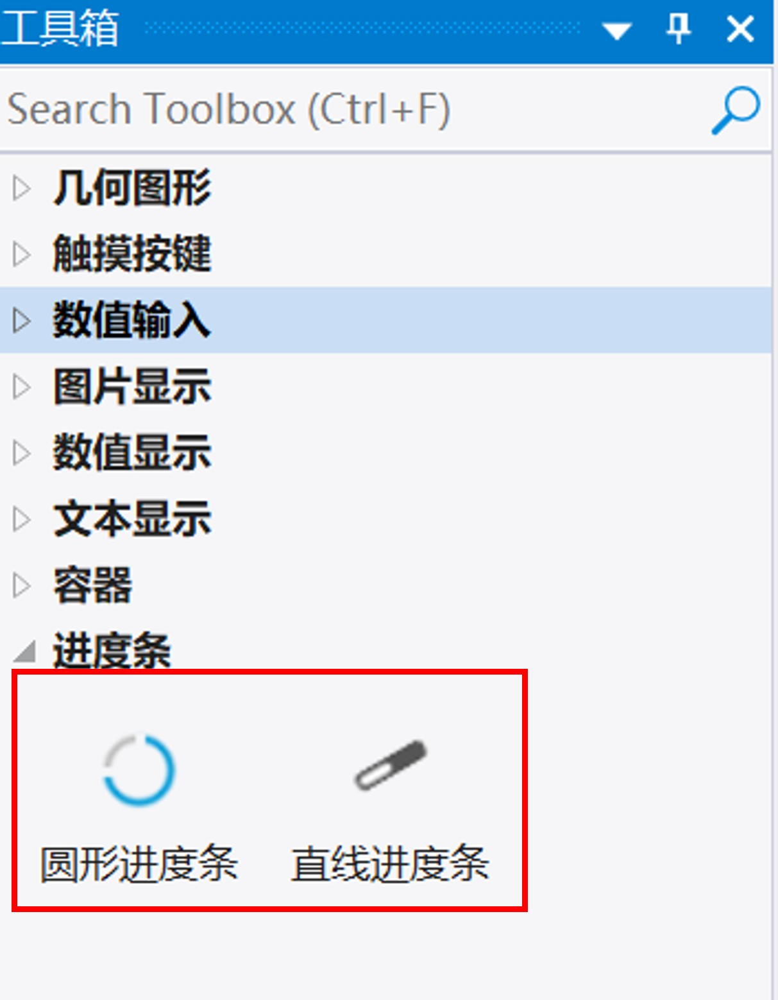
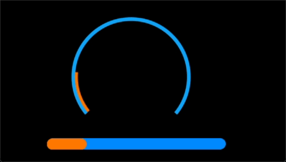
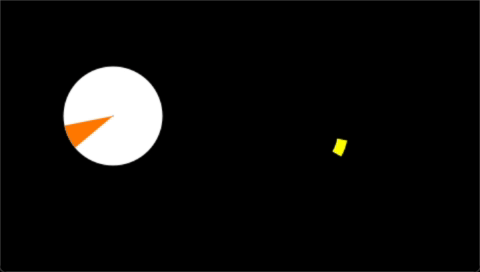
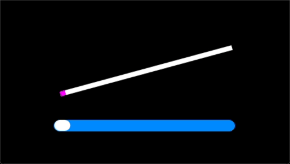

# 8 进度条控件组

<figure><figcaption>
工具箱中的进度条控件
</figcaption></figure>

<figure><figcaption>
模拟器中运行的进度条控件
</figcaption></figure>

## 8.1 圆形进度条

圆形进度条显示当前进度，将控件置于背景图像上方作为进度指示器。圆环的颜色、透明度、以及整体参数都可以设置。可以创建自定义背景图像，更改指示器的参数以适应自定义背景图。

<figure><figcaption>
模拟器中运行的圆形进度条
</figcaption></figure>

### 属性

<table><thead><tr><th width="145.44903564453125">属性组</th><th>属性说明</th></tr></thead><tbody><tr><td>名称</td><td>控件名称，可以修改</td></tr><tr><td>位置</td><td>锁定 锁定/解锁对象的大小和位置</td></tr><tr><td></td><td>X/Y 指定控件坐标（坐标原点为画布左上角）</td></tr><tr><td></td><td>宽度/高度 对像的宽度/高度值（单位：像素）</td></tr><tr><td>外观 背景</td><td>图片 设置进度条背景</td></tr><tr><td></td><td>渲染模式 单色填充/渐变/纹理贴图三种可选</td></tr><tr><td>显示</td><td>设置显示或隐藏本对象</td></tr><tr><td>不透明度</td><td>设置不透明度（0-100），0完全透明，100完全不透明 可以绑定变量</td></tr><tr><td>编辑预览</td><td>约束方式 设置在编辑模式下圆心、半径圆弧起始点/结束点各个参数之前的约束模式。若进度条是整男同学，请选中圆心半径方式。1、三点画圆弧 圆弧起始点/结束点可以自由移动，圆心和半径跟随变化 2、圆心半径方式:圆弧起始点/结束点受约束，仅可沿圆心半径确定的圆弧轨迹移动</td></tr><tr><td></td><td>显示辅助线 设置在编辑模式下是否开启显示辅助轨迹线</td></tr><tr><td>形状</td><td>圆心X/Y 设置圆环的圆心XY坐标</td></tr><tr><td></td><td>半径 设置圆形进度条的半径</td></tr><tr><td></td><td>线宽 设置圆环的宽度</td></tr><tr><td></td><td>末端式样 平头/圆帽 设置圆弧末端线帽样式。1、平头：圆弧末端平直边缘式样；2、圆帽：圆弧末端将扩展显示为半圆形（以线宽的一半作为半径）；</td></tr><tr><td></td><td>起始角度 设置进度条的起始角度，当起始角小于结束角时，进度条绘制方向为顺时针。当起始角大于结束角时，进度条绘制方向为逆时针</td></tr><tr><td></td><td>结束角度 设置进度条的结束角度，当起始角小于结束角时，进度条绘制方向为顺时针。当起始角大于结束角时，进度条绘制方向为逆时针</td></tr><tr><td>范围</td><td>默认最小值 设置进度条取值范围最低值，通常为0，可以绑定变量</td></tr><tr><td></td><td>默认最大值 设置进度条取值范围最大值，通常为0，可以绑定变量</td></tr><tr><td></td><td>最低阈值级 设置进度条显示的最低阈值，当输入的进度值低于该值时，进度条固定显示阈值对应的进度</td></tr><tr><td></td><td>划分级数 将进度条的整个进度值范围划分为多少级</td></tr><tr><td>控制</td><td>进度值 设置指定进度条值，或者绑定到变量中</td></tr></tbody></table>

## 8.2 直线进度条

直线进度条显示当前进度，方法是将线条置于背景图像上方作为进度提示器。该线条既不需要水平也不需要垂直，可以从任意坐标开始，在任意坐标结束。

<figure><figcaption>
模拟器中运行的直线进度条
</figcaption></figure>

### 属性

<table><thead><tr><th width="152.06060791015625">属性组</th><th>属性说明</th></tr></thead><tbody><tr><td>名称</td><td>控件名称，可以修改</td></tr><tr><td>位置</td><td>锁定 锁定/解锁对象的大小和位置</td></tr><tr><td></td><td>X/Y 指定控件坐标（坐标原点为画布左上角）</td></tr><tr><td></td><td>宽度/高度 对像的宽度/高度值（单位：像素）</td></tr><tr><td>外观 背景</td><td>图片 设置进度条背景</td></tr><tr><td></td><td>渲染模式 单色填充/渐变/纹理贴图三种可选</td></tr><tr><td>显示</td><td>设置显示或隐藏本对象</td></tr><tr><td>不透明度</td><td>设置不透明度（0-100），0完全透明，100完全不透明 可以绑定变量</td></tr><tr><td>形状</td><td>线宽 设置圆环的宽度</td></tr><tr><td></td><td>末端式样 平头/圆帽 设置圆弧末端线帽样式。1、平头：圆弧末端平直边缘式样；2、圆帽：圆弧末端将扩展显示为半圆形（以线宽的一半作为半径）；</td></tr><tr><td></td><td>起始端X坐标/Y坐标 设置进度条起始端的XY坐标</td></tr><tr><td></td><td>结束端X坐标/Y坐标 设置进度条结束端的XY坐标</td></tr><tr><td>范围</td><td>默认最小值 设置进度条取值范围最低值，通常为0，可以绑定变量</td></tr><tr><td></td><td>默认最大值 设置进度条取值范围最大值，通常为0，可以绑定变量</td></tr><tr><td></td><td>最低阈值级 设置进度条显示的最低阈值，当输入的进度值低于该值时，进度条固定显示阈值对应的进度</td></tr><tr><td></td><td>划分级数 将进度条的整个进度值范围划分为多少级</td></tr><tr><td>控制</td><td>进度值 设置指定进度条值，或者绑定到变量中</td></tr></tbody></table>

