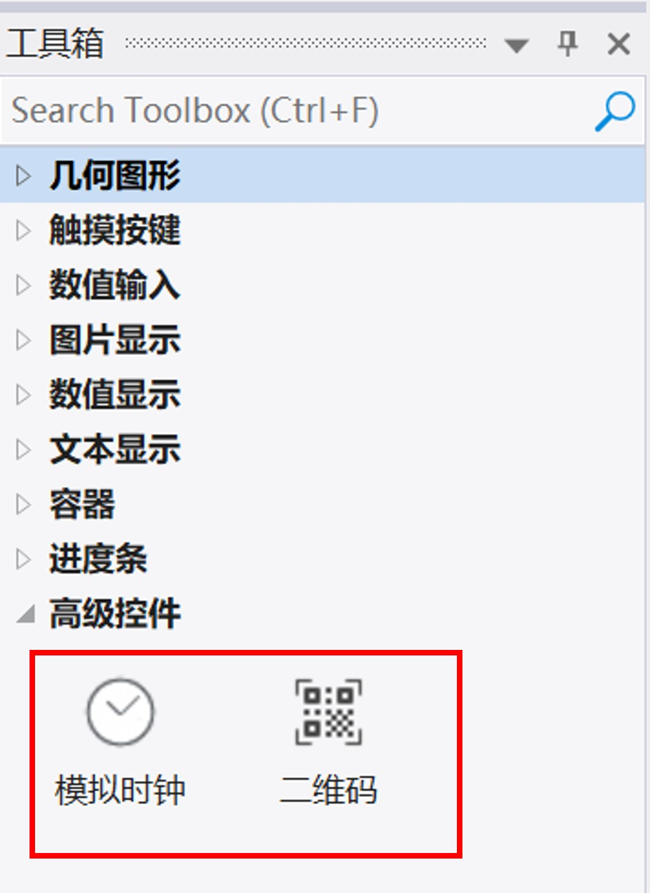

# 9 高级控件组

<figure><figcaption>
工具箱中的高级控件组
</figcaption></figure>

## 9.1 模拟时钟

## 9.2 二维码

二维码是一种能绘制二维码的控件，其中提供了要编码的内容，可以指定前景和背景颜色。

<figure><figcaption>
模拟器中运行的QR控件
</figcaption></figure>

### 属性

<table><thead><tr><th width="112.942138671875">属性组</th><th>属性说明</th></tr></thead><tbody><tr><td>名称</td><td>控件名称，可以修改，具有唯一性</td></tr><tr><td>位置</td><td>锁定 锁定/解锁对象的大小和位置</td></tr><tr><td></td><td>X/Y 指定控件坐标（坐标原点为画布左上角）</td></tr><tr><td></td><td>宽度/高度 对像的宽度/高度值（单位：像素）</td></tr><tr><td>外观</td><td>显示 设置显示或隐藏本对象</td></tr><tr><td></td><td>不透明度（0-100），0完全透明，100完全不透明 可以绑定变量</td></tr><tr><td></td><td>前景颜色 设置二维码的颜色</td></tr><tr><td></td><td>背景颜色 设置二维码的背景颜色</td></tr><tr><td></td><td>包边厚度 设置二维码四周留白区域厚度</td></tr><tr><td>数据</td><td>文本 设置需要生成二维码的文本数据 也可以绑定变量</td></tr><tr><td></td><td>纠错等级 设置需要二维码数据的纠错级别</td></tr></tbody></table>
