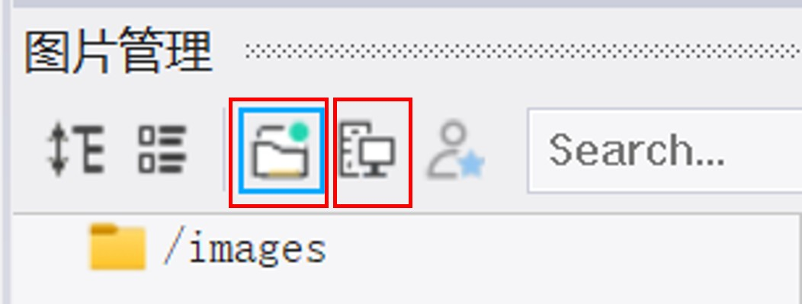

# 1 软件工作界面介绍

## 1.1 软件安装

XX软件是深圳XX公司自主创新开发的一款功能强大帮助客户快速进行GUI开发的调试软件。

> 环境：windows
>
> 软件下载：

根据提示选择安装目录，按照提示完成安装。

## 1.2 工作界面介绍

成功安装软件后，打开工程案例，工作界面如下：

<figure><figcaption>
软件工作界面
</figcaption></figure>



**菜单栏**

工作区域包括文件/编辑/视图/布局/项目/生成/设置/帮助 等栏目



**视图工具栏**

包括：属性/工具箱/输出窗口/文件导航/画面结构/图片管理/变量管理/交互编辑器/动画编辑器/变量编辑器/结构体定义



**生成区域**

生成区域主要有生成、运行、停止等

生成：可以在输出窗口看到生成的结果，以及错误提示。

运行：对生成的文件，在模拟器中运行

停止：停止模拟器运行



**文件导航面板**

可以查看已经创建的窗体画面，加载图片，文本等列表。
\
可以新建窗体，导入已有窗体文件，设置启动窗体，对窗体文件重命名、移除等操作。

<figure><figcaption>
文件导航操作
</figcaption></figure>




**画面结构面板**

打开的工程文件中，可以查看选中窗体下所有控件及树的层级结构，通过拖动树中对象的顺序或层级来改变其在Z轴顺序。操作如下图：

<figure><figcaption>
画面结构展示了当前窗体中所有控件的在树中的层级
</figcaption></figure>




**画布编辑窗口**

UI界面的编辑区，在此区域拖放控件，即可完成控件的创建。画布区还可以完成对控件的编辑，删除等操作。如果你希望在画布上显示标尺，可以点击工具栏的启用该功能。

<figure><figcaption>
画布编辑窗口可以对控件进行添加、编辑、删除等操作，操作区域可以显示标尺
</figcaption></figure>



**工具箱（控件组）**

工具箱选项卡中包含所有已分类的可用控件列表。点击某类的控件组选项卡，将会打开该类控件包含的可用控件列表。

点击其中一个控件，可将其添加到当前画布上。

“工具箱”下有一个搜索栏，输入控件名称，可帮助查找出最佳匹配的控件。

<figure><figcaption>
工具箱中的控件组以及如何查找
</figcaption></figure>

**控件选择**&#x20;

在画布中选中，也可以多选，按住CTRL 键的同时，单击多个控件。

**控件Z轴顺序调节**

控件的Z轴顺序可以通过“画面结构”选项卡中，拖动树中的顺序或层级来改变。

**内容裁剪控制**

在画布上，屏幕、自定义容器及其子类的边界之外的控件会被裁剪掉。

\




**输出窗口/图片管理/**<mark style="color:red;">**变量编辑**</mark>**/动画编辑/**<mark style="color:red;">**结构体编辑器**</mark>

* **输出窗口**\
  ​编译当前工程时，显示所有错误、警告。

<figure><figcaption>
输出窗口编译当前工程文件时，显示所有错误、警告
</figcaption></figure>

* **图片管理**

<figure><figcaption>
图片管理窗口
</figcaption></figure>

<mark style="color:red;">上图中图片管理窗口分别为：工程图片资源、软件自带图片库资源。</mark>

* **动画编辑器**

动画编辑器窗口可以对控件或画面进行渐变（fade animation）和移动（translate animation）两种动画操作。前者通过设置关键帧的alpha值来实现渐变；后者通过设置关键帧的XY值来实现位置的移动。

<figure><figcaption>
动画编辑器窗口
</figcaption></figure>

**新建动画组**

首先在动画编辑器窗品**使能**动画后，选择新建动画组，当出现下图的弹出窗口后，再对动画组ID进行命名，选择要操作的对象（支持多选）。

<figure><figcaption>
新建动画组-----弹出窗口
</figcaption></figure>

如下图所示，操作对象出现在动画编辑窗口中，点击选择动画类型（支持多选）：fade animation、 translate animation。

<figure><figcaption>
动画编辑窗口和弹出窗口的动画类型选择
</figcaption></figure>

**建立关键帧**

点击建立关键帧，并在属性窗口中对关键帧设置相关参数。

<figure><figcaption></figcaption></figure>

<mark style="color:red;">具体请参考动画相关例程。</mark>

* <mark style="color:red;">**变量编辑器**</mark>

<figure><figcaption>
变量编辑器窗口
</figcaption></figure>

变量是实现动态交互、数据存储、复杂逻辑的重要工具。通过变量可以简化工作流程、提高设计效率、增强协作并创建适应用强的交互设计、提升设计可扩展性和整体质量。

**变量类型：**

全局变量：整个原型中可访问，用于整个系统的数据传递。

局部变量：仅在当前的交互动作中使用。变量属于某个控件时，那么这些变量仅能被这个控件或者控件的子控件们访问。

**操作变量**

创建变量：先确定要创建的对象是全局变量还是局部变量，在变量编辑器窗口中，点击可以进行的全局和当前变量的切换，当图标变成时，创建的是全局变量。点击添加变量，弹出如下窗口，输入变量名称，设置变量类型。

<figure><figcaption>
弹出窗口
</figcaption></figure>

变量类型：Int32、Bool、Char、Color、Double、Float、Imageld、Int16、Int32、String、Textld  Uchar、Uint16、Uint32以及自己创建的结构体类型。

数组：数组可以存储多个数据，是相同数据类型的集合，数组让数据保持整洁。索引从0开始。




属性/交互编辑窗口

* **属性编辑器**

画布右侧边栏允许查看和调整文件中对象的属性。每个控件都有相关预定义的属性，可以依具需求对这些属性进行设置，以实现自己需要的界面效果。相关的属性包括不限于控件尺寸、位置和颜色等位置属性，还包括控制其行为相关的外观属性，如是否可见、透明度等。<mark style="color:red;">还可以通过配置控件的控制属性，绑定相关变量，以达到其与外部硬件产生相关交互的目的。</mark>

* **交互编辑器**

交互编辑器是对对象设置触发事件时要执行的动作。一个完整的交互由触发事件和动作组成。

> 触发事件是引起“交互”的条件，为了让“动作”发生，应用中需要发生的事件。
>
> 动作是触发事件发出时将发生的行为。

<mark style="color:red;">软件不仅支持给单个控件、窗体添加交互，也支持用“容器”给某一片区域添加交互。除此之外还可以对整个系统添加交互，也称为全局交互逻辑，事件称之为系统事件。全局交互逻辑和对象交互逻辑的事件和动作（Events\&Actions)如图1和图2所示。</mark>

<figure><figcaption>
图1：全局交互逻辑中的事件和动作
</figcaption></figure>

<figure><figcaption>
图2：对象交互逻辑中的事件和动作
</figcaption></figure>

<figure><figcaption>
图3：交互逻辑中的两种选择
</figcaption></figure>

**添加、删除交互逻辑：**&#x5982;需要对某个对象作交互，首先选中对象，然后在交互编辑选项卡中点击图3左侧，进行全局交互或对象交互切换，选择需要的交互方式后，再点击“添加交互逻辑”，依次设定事件和动作。交互逻辑添加成功后，对象的交互逻辑可以进行删除、编辑，具体操作如下图所示：

<figure><figcaption>
选中对象后添加、删除交互逻辑
</figcaption></figure>




